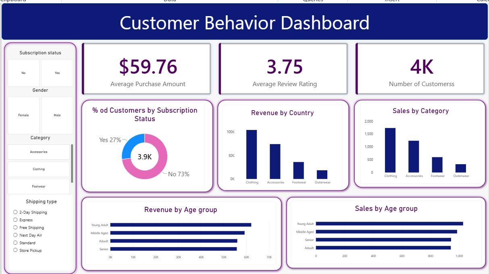

# Customer Shopping Behavior Analysis

A data analysis project exploring customer shopping behavior using **Python, MYSQL, and Power BI**.

## 📊 Project Overview

This project analyzes **3,900 customer purchases** to understand spending patterns, customer segments, product preferences, discounts, and subscription behavior.

## 🛠️ Tools Used

* Python
* Pandas
* Matplotlib
* Seaborn
* MYSQL
* Power BI
* Jupyter Notebook

## 🔍 Analysis

* Data cleaning and preprocessing using Python
* Exploratory Data Analysis (EDA)
* Feature engineering
* SQL-based business analysis
* Customer segmentation
* Product and revenue analysis
* Interactive Power BI dashboard

## 🗄️ SQL Business Analysis

The SQL analysis focused on:

* Revenue comparison by gender
* High-spending customers who used discounts
* Top 5 products based on average ratings
* Average purchase amount  and non-subscribers
* Products with the highest discount usage
* Customer segmentation into **New, Returning, and Loyal**
* Top 3 most-purchased products in each category
* Relationship between repeatby shipping type
* Comparison of subscribers buyers and subscriptions
* Revenue contribution by age group

## 📈 Power BI Dashboard



The dashboard presents the main findings from the analysis in an interactive and visual format.

## 💡 Key Insights

* Analyzed customer spending across different demographic groups
* Identified top-rated and frequently purchased products
* Compared subscriber and non-subscriber purchasing behavior
* Examined discount usage and customer purchasing patterns
* Analyzed customer segments based on previous purchases
* Compared revenue contribution across age groups

## 📁 Project Structure

```text
 Customer-Shopping-Behavior-Analysis/
│
├── data/
├── python/
├── sql/
├── power BI/
│   └── Customer_Shopping_Behavior.pbix
├── presentation/
│   └── Customer_Shopping_Behavior_Analysis.pdf
├── images/
│   └── dashboard.png
└── README.md
```

## 👩‍💻 Author

**Irsa Shakeel**

Aspiring Data Analyst | Python | SQL | Power BI
